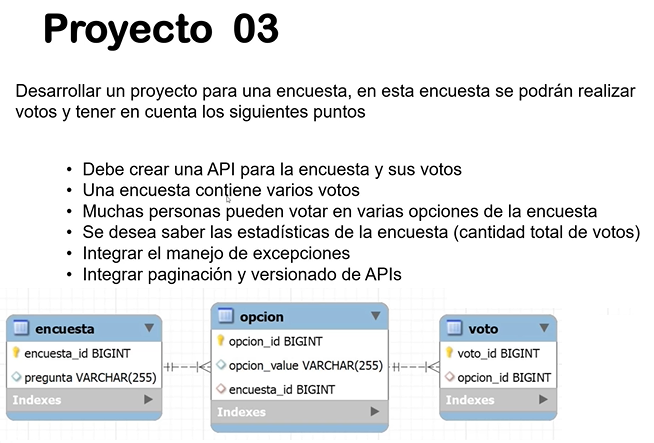
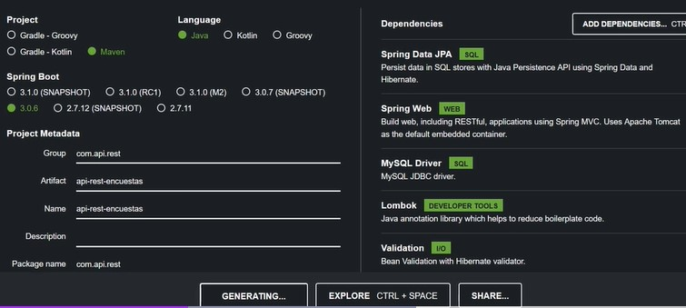

# Proyecto 03: API para Encuestas y Votos

Este proyecto consiste en desarrollar una API que permita gestionar encuestas y los votos asociados a estas. A continuación, se detallan los requisitos y funcionalidades implementadas.

<div align="center">
   <h1>Challenge | Java | Back End - SpringBoot | API REST - Encuestas</h1>
</div>


<p align="center">
  <br>
  
  
</p>

👨🏻‍💻 <strong>Gerson Escobedo Pérez </strong></br>
<a href="https://www.linkedin.com/in/gerson-escobedo/" target="_blank">
</a>


---

## Requisitos

- Crear una API para la gestión de encuestas y sus votos.
- Cada encuesta contiene varias opciones y votos.
- Soportar múltiples votantes, permitiendo que una persona vote en varias opciones de la encuesta.
- Generar estadísticas de las encuestas, incluyendo el total de votos.
- Integrar manejo de excepciones.
- Implementar paginación y versionado de APIs.

---

## Estructura del Proyecto

1. **Versionado de APIs:**
    - Se implementaron dos versiones de la API: `v1` y `v2`.
    - Las rutas están separadas por prefijos (`/v1` y `/v2`).
2. **Paginación:**
    - Los resultados de las encuestas y votos están paginados para optimizar el consumo de datos.
3. **Excepciones:**
    - Manejador global para capturar y responder con mensajes claros en caso de errores.

---

## Requerimientos del Proyecto

A continuación, se presentan los principales requerimientos y dependencias del proyecto:

### Imagen de Requerimientos


### Dependencias del Proyecto


---

## Instalación

1. Clonar el repositorio:
   ```bash
   git clone https://github.com/Gerson121295/SWR-P03-Encuestas.git
   ```
2. Navegar al directorio del proyecto:
   ```bash
   cd <SWR-P03-Encuestas>
   ```
3. Construir el proyecto con Maven:
   ```bash
   mvn clean install
   ```
4. Ejecutar la aplicación:
   ```bash
   mvn spring-boot:run
   ```

---

## Endpoints Principales
### Version 2 (v2):
#### Para acceder a la Version 1 - cambiar v1 en las rutas 

- **Obtener encuestas:**
  ```http
  GET http://localhost:8080/v2/encuesta
  ```
  
    - **Obtener encuesta por Id:**
  ```http
  GET http://localhost:8080/v2/encuesta/1
  ```
  
    - **Eliminar encuesta por Id:**
  ```http
  DELETE http://localhost:8080/v2/encuesta/1
  ```
- **Crear encuesta:**
  ```http
  POST  http://localhost:8080/v2/encuesta
  ```

 ```json
 {
  "pregunta": "¿Cual es el lenguaje de programacion mejor pagado 2025?",
  "opciones":[
    {"value":"Java"},
    {"value":"C"},
    {"value":"C++"},
    {"value":"JavaScript"},
    {"value":"Go"}
  ]
}
 ```

  - **Actualizar encuesta:**
    ```http
    PUT  http://localhost:8080/v2/encuesta/1
    ```
      ```json
    {
        "pregunta": "¿Cual considera que es su lenguaje de programacion favorito en 2025?",
        "opciones":[
            {"value":"Java"},
            {"value":"C"},
            {"value":"C++"}
        ]
    }
      ```
      - **Crear voto a encuesta:**
    ```http
    POST   http://localhost:8080/v2/encuesta/votos/1
    ```
    ```json
    {
        "opcion": {
            "id": 1,
            "value": "JavaScript"
        }
    }
    ```    
- **Obtener resultados de votos de la encuesta:**
  ```http
  GET http://localhost:8080/v2/encuesta/votos/1
  ```

- **Calcular el resultados de encuesta:**
  ```http
  GET http://localhost:8080/v2/encuesta/calcularResultado?encuestaId=1
  ```

---

## 🖥️ Tecnologías utilizadas
- ☕ Java 17
- JPA Hibernate
- [Intellij](https://www.jetbrains.com/idea/)
- [MySql](https://www.mysql.com/)
- [Java](https://www.java.com/en/)

---

## ⚠️ Importante! ⚠️
☕ Usar Java versión 8 o superior para compatibilidad. </br></br>
📝 Recomiendo usar el editor de Intellij</br></br>


# 💙 Personas Contribuyentes
## Autores
[<br><sub>Gerson Escobedo</sub>](https://github.com/gerson121295)

# Licencia


License: [MIT](License.txt)